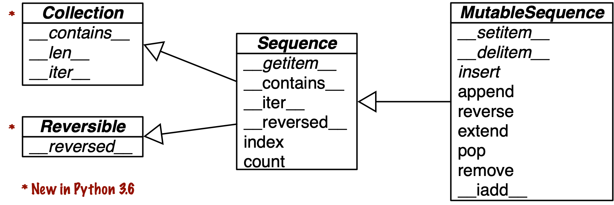
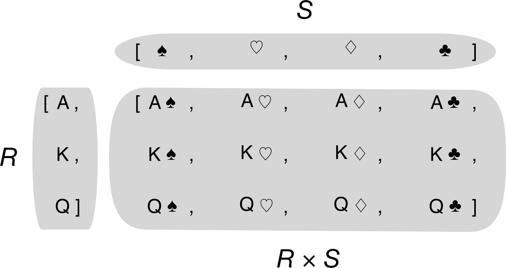
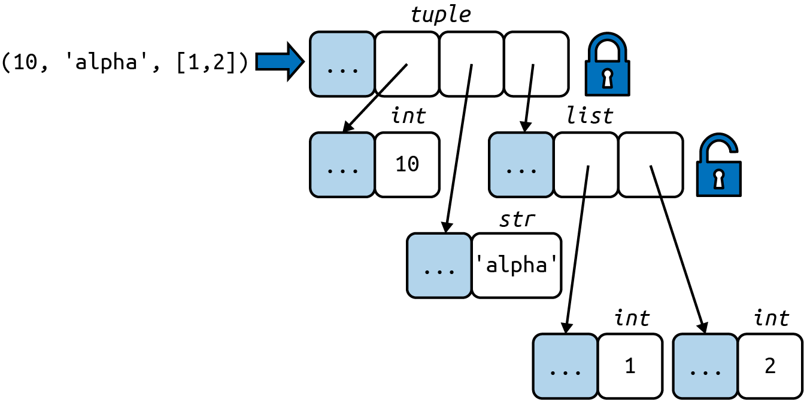

# Uma coleção de sequências

> "Como podem ter notado, várias das operações mencionadas funcionam da mesma forma com textos, listas e tabelas. Coletivamente, textos, listas e tabelas são chamados de 'trens' (trains). […​] A instrução `FOR` também funciona, de forma genérica, com trens."
> — Leo Geurts, Lambert Meertens, e Steven Pembertonm - ABC Programmer's Handbook (Bosko Books) p.8

Antes de criar Python, Guido foi um dos desenvolvedores da linguagem ABC, um projeto de pesquisa de 10 anos para criar um ambiente de programação para iniciantes. A ABC introduziu várias ideias que hoje consideramos "pythônicas": operações genéricas com diferentes tipos de sequências, tipos tupla e mapeamento embutidos, estrutura de blocos por indentação, tipagem forte sem declaração de variáveis, entre outras. A usabilidade de Python não é acidental.

Python herdou da ABC o tratamento uniforme de sequências. Strings, listas, sequências de bytes, arrays, elementos XML e resultados vindos de bancos de dados compartilham um rico conjunto de operações comuns, incluindo iteração, fatiamento, ordenação e concatenação.

Entender a variedade de sequências disponíveis no Python evita reinventar a roda, e sua interface comum nos inspira a criar APIs que suportem e aproveitem bem os tipos de sequências existentes e futuros.

A maior parte deste capítulo trata das sequências em geral, desde a conhecida `list` até os tipos `str` e `bytes`, adicionados no Python 3. Tópicos específicos sobre listas, tuplas, arrays e filas também foram incluídos, mas os detalhes sobre strings Unicode e sequências de bytes são tratados no [Capítulo 4](04-texto-em-unicode-versus-bytes.md). Além disso, a ideia aqui é falar sobre os tipos de sequências prontas para usar. A criação de novos tipos de sequência é o tema do [Capítulo 12](../../3-volume-2/1-parte-iii-classes-e-protocolos/12-metodos-especiais-para-sequencias.md).

Os principais tópicos cobertos neste capítulo são:

- Compreensão de listas e os fundamentos das expressões geradoras
- Usar tuplas como registros ou como listas imutáveis
- Desempacotamento de sequências e padrões de sequências
- Fatiamento de sequências para leitura e escrita
- Tipos especializados de sequências, como arrays e filas

## Novidades neste capítulo

A atualização mais importante desse capítulo é a [Seção 2.6](#pattern-matching-com-sequências), primeira abordagem das instruções `match/case` introduzidas no Python 3.10.

As outras mudanças são aperfeiçoamentos da primeira edição:

- Um novo diagrama e uma nova descrição do funcionamento interno das sequências, contrastando contêineres e sequências planas.
- Uma comparação entre `list` e `tuple` quanto ao desempenho e ao armazenamento.
- Ressalvas sobre tuplas com elementos mutáveis, e como detectá-los se necessário.

Movi a discussão sobre tuplas nomeadas para a [Seção 5.3](05-fabricas-de-classes-de-dados.md#tuplas-nomeadas-clássicas) ([Capítulo 5](05-fabricas-de-classes-de-dados.md)), onde elas são comparadas com `typing.NamedTuple` e `@dataclass`.

> ℹ️ Para abrir espaço para conteúdo novo mantendo o número de páginas dentro do razoável, a seção "Managing Ordered Sequences with Bisect" ("_Gerenciando sequências ordenadas com bisect_") da primeira edição agora é um [artigo](https://www.fluentpython.com/extra/ordered-sequences-with-bisect/) (EN) no site que complementa o livro.

## Uma visão geral das sequências embutidas

A biblioteca padrão oferece uma boa seleção de tipos de sequências, implementadas em C:

**Sequências contêiner**
&nbsp;&nbsp;&nbsp;&nbsp; Podem armazenar itens de tipos diferentes, incluindo contêineres aninhados e objetos de qualquer tipo. Alguns exemplos: `list`, `tuple`, e `collections.deque`.

**Sequências planas**
&nbsp;&nbsp;&nbsp;&nbsp; Armazenam itens de algum tipo simples, mas não outras coleções ou referências a objetos. Alguns exemplos: `str`, `bytes`, e `array.array`.

Uma _sequência contêiner_ mantém referências para os objetos que contém, que podem ser de qualquer tipo, enquanto uma _sequência plana_ armazena o valor de seu conteúdo em seu próprio espaço de memória, e não como objetos Python distintos. Veja a @fig-mem-diagram.


![Diagramas de memória simplificados mostrando uma `tuple` e um `array`, cada uma com três itens. As células em cinza representam o cabeçalho de cada objeto Python na memória. A `tuple` tem um array de ponteiros para seus itens. Cada item é um objeto Python separado, possivelmente contendo também referências aninhadas a outros objetos Python, como aquela lista de dois itens. Por outro lado, um `array` Python é um único objeto, contendo um array da linguagem C com três números de ponto flutuante no formato nativo da CPU.](../../images/figure-3.png){#fig-mem-diagram}

Dessa forma, sequências planas são mais compactas, mas só podem armazenar valores primitivos como bytes e números inteiros e de ponto flutuante.

> ℹ️ Todo objeto Python na memória tem um cabeçalho com metadados. O objeto Python mais simples, um `float`, tem um campo de valor e dois campos de metadados:
> - `ob_refcnt`: a contagem de referências ao objeto
> - `ob_type`: um ponteiro para o tipo do objeto
> - `ob_fval`: um double de C mantendo o valor do `float`
> 
> No Python 64-bits, cada um desses campos ocupa 8 bytes. Por isso um array de números de ponto flutuante é mais compacto que uma tupla de números de ponto flutuante: o array é um único objeto contendo apenas o valor dos números, enquanto a tupla consiste de vários objetos, a própria tupla e cada objeto `float` que ela contém.

Outra forma de agrupar as sequências é por mutabilidade:

**Sequências mutáveis**
&nbsp;&nbsp;&nbsp;&nbsp; Por exemplo, `list`, `bytearray`, `array.array` e `collections.deque`.

**Sequências imutáveis**
&nbsp;&nbsp;&nbsp;&nbsp; Por exemplo, `tuple`, `str`, e `bytes`.

A @fig-simple-uml-diagram ajuda a visualizar como as sequências mutáveis herdam todos os métodos das sequências imutáveis e implementam vários métodos adicionais. Os tipos embutidos de sequências na verdade não são subclasses das classes base abstratas (ABCs) `Sequence` e `MutableSequence`, mas sim _subclasses virtuais_ registradas com aquelas ABCs, como veremos no [Capítulo 13](../../3-volume-2/1-parte-iii-classes-e-protocolos/13-interfaces-protocolos-e-abcs.md). Por serem subclasses virtuais, `tuple` e `list` passam nesses testes:

```python
>>> from collections import abc
>>> issubclass(tuple, abc.Sequence)
True
>>> issubclass(list, abc.MutableSequence)
True
```

{#fig-simple-uml-diagram}

Lembre-se dessas características básicas: mutável versus imutável; contêiner versus plana. Elas ajudam a extrapolar o que se sabe sobre um tipo de sequência para outros tipos.

O tipo mais fundamental de sequência é a lista: um contêiner mutável. Espero que você já esteja muito familiarizada com listas, então vamos passar diretamente para a compreensão de listas, uma forma potente de criar listas que algumas vezes é subutilizada por sua sintaxe parecer, a princípio, estranha. Dominar as compreensões de listas abre as portas para expressões geradoras que, entre outros usos, podem produzir elementos para preencher sequências de qualquer tipo. Ambas são temas da próxima seção.

## Compreensões de listas e expressões geradoras

Um jeito rápido de criar uma sequência é usando uma compreensão de lista (se o alvo é uma `list`) ou uma expressão geradora (para outros tipos de sequências). Se você não usa essas formas sintáticas diariamente, aposto que está perdendo oportunidades de escrever código mais legível e, muitas vezes, mais rápido também.

Se você duvida de minha alegação, sobre essas formas serem "mais legíveis", continue lendo. Vou tentar convencer você.

> 💡 Por comodidade, muitos programadores Python se referem a compreensões de listas como _listcomps_, e a expressões geradoras como _genexps_. Usarei também esses dois termos.

### Compreensões de lista e legibilidade

Em sua opinião qual desses exemplos é mais fácil de ler, o @exm-unicode-list ou o @exm-unicode-listcomp?

::: {#exm-unicode-list}
**Cria uma lista de códigos Unicode a partir de uma string**

```python
>>> symbols = '$¢£¥€¤'
>>> codes = []
>>> for symbol in symbols:
...     codes.append(ord(symbol))
...
>>> codes
[36, 162, 163, 165, 8364, 164]
```

:::

::: {#exm-unicode-listcomp}
**Cria uma lista de códigos Unicode a partir de uma string, usando uma listcomp**

```python
>>> symbols = '$¢£¥€¤'
>>> codes = [ord(symbol) for symbol in symbols]
>>> codes
[36, 162, 163, 165, 8364, 164]
```

:::

Qualquer um que saiba um pouco de Python consegue ler o @exm-unicode-list. Entretanto, após aprender sobre as listcomps, acho o @exm-unicode-listcomp mais legível, porque deixa sua intenção explícita.

Um laço `for` pode ser usado para muitas coisas diferentes: percorrer uma sequência para contar ou encontrar itens, computar valores agregados (somas, médias), ou inúmeras outras tarefas. O código no @exm-unicode-list está criando uma lista. Uma listcomp, por outro lado, é mais clara. Seu objetivo é sempre criar uma nova lista.

Naturalmente, é possível abusar das compreensões de lista para escrever código verdadeiramente incompreensível. Já vi código Python usando listcomps apenas para repetir um bloco de código por seus efeitos colaterais. Se você não vai fazer alguma coisa com a lista criada, não deveria usar essa sintaxe. Além disso, tente manter o código curto. Se uma compreensão ocupa mais de duas linhas, provavelmente seria melhor quebrá-la ou reescrevê-la como um bom e velho laço `for`. Avalie qual o melhor caminho: em Python, como em português, não existem regras absolutas para se escrever bem.

> 💡 **Dica de sintaxe**
> Em código Python, quebras de linha são ignoradas dentro de pares de `[]`, `{}`, ou `()`. Então você pode usar múltiplas linhas para criar listas, listcomps, tuplas, dicionários, etc., sem necessidade de usar o marcador de continuação de linha `\`, que não funciona se após o `\` você acidentalmente digitar um espaço. Outro detalhe, quando aqueles pares de delimitadores são usados para definir um literal com uma série de itens separados por vírgulas, uma vírgula solta no final será ignorada. Daí, por exemplo, quando se codifica uma lista a partir de um literal com múltiplas linhas, é uma gentileza deixar uma vírgula após o último item. Isso torna um pouco mais fácil ao próximo programador acrescentar mais um item àquela lista, e reduz o ruído quando se lê os diffs.

> **Escopo local dentro de compreensões e expressões geradoras**
> No Python 3, compreensões de lista, expressões geradoras, e suas irmãs, as compreensões de `set` e de `dict`, tem um escopo local para manter as variáveis criadas na condição `for`. Entretanto, variáveis atribuídas com o "operador morsa" ("_Walrus operator_"), `:=`, continuam acessíveis após aquelas compreensões ou expressões retornarem, diferente das variáveis locais em uma função. A [PEP 572—Assignment Expressions](https://peps.python.org/pep-0572/) (EN) define o escopo do alvo de um `:=` como a função à qual ele pertence, exceto se houver uma declaração `global` ou `nonlocal` para aquele identificador.[[7](../../5-postfacio/footnote.md#L7)]
>
> ``` python
> >>> x = 'ABC'
> >>> codes = [ord(x) for x in x]
> >>> x  # (1)
> 'ABC'
> >>> codes
> [65, 66, 67]
> >>> codes = [last := ord(c) for c in x]
> >>> last  # (2)
> 67
> >>> c  # (3)
> Traceback (most recent call last):
>   File "<stdin>", line 1, in <module>
> NameError: name 'c' is not defined
> ```
> **1**. `x` não foi sobrescrito: continua vinculado a `'ABC'`.
> **2**. `last` permanece.
> **3**. `c` desapareceu; ele só existiu dentro da listcomp.

Compreensões de lista criam listas a partir de sequências ou de qualquer outro tipo iterável, filtrando e transformando os itens. As funções embutidas `filter` e `map` podem fazer o mesmo, mas perdemos legibilidade, como veremos a seguir.

### Listcomps versus map e filter

Listcomps fazem tudo que as funções `map` e `filter` fazem, sem os malabarismos exigidos pela funcionalidade limitada do `lambda` de Python.

Considere o @exm-list-versus-mapfilter.

::: {#exm-list-versus-mapfilter}
**A mesma lista, criada por uma listcomp e por uma composição de map/filter**

```python
>>> symbols = '$¢£¥€¤'
>>> beyond_ascii = [ord(s) for s in symbols if ord(s) > 127]
>>> beyond_ascii
[162, 163, 165, 8364, 164]
>>> beyond_ascii = list(filter(lambda c: c > 127,
...                            map(ord, symbols)))
>>> beyond_ascii
[162, 163, 165, 8364, 164]
```

:::

Eu imaginava que `map` e `filter` fossem mais rápidas que as listcomps equivalentes, mas Alex Martelli assinalou que não é o caso, pelo menos não nos exemplos acima. O script [listcomp_speed.py](https://github.com/fluentpython/example-code-2e/blob/master/02-array-seq/listcomp_speed.py) no [repositório de código de Python Fluente](https://github.com/fluentpython/example-code-2e) é um teste de desempenho simples, comparando listcomp com `filter/map`.

Vou falar mais sobre `map` e `filter` no [Capítulo 7](../2-parte-ii-funcoes-como-objetos/7-funcoes-como-objetos-de-primeira-classe.md). Vamos agora ver o uso de listcomps para computar produtos cartesianos: uma lista contendo tuplas criadas a partir de todos os itens de duas ou mais listas.

### Produtos cartesianos

Listcomps podem criar listas a partir do produto cartesiano de dois ou mais iteráveis. Os itens resultantes de um produto cartesiano são tuplas criadas com os itens de cada iterável na entrada, e a lista resultante tem o tamanho igual ao produto dos tamanhos dos iteráveis usados. Veja a @fig-cartesian-product.

{#fig-cartesian-product}

Por exemplo, imagine que você precisa produzir uma lista de camisetas disponíveis em duas cores e três tamanhos. O @exm-cartesian-product mostra como produzir tal lista usando uma listcomp. O resultado tem seis itens.

Produto cartesiano usando uma compreensão de lista

::: {#exm-cartesian-product}
**Produto cartesiano usando uma compreensão de lista**

```python
>>> colors = ['black', 'white']
>>> sizes = ['S', 'M', 'L']
>>> tshirts = [(color, size) for color in colors
...                          for size in sizes]  # (1)
>>> tshirts
[('black', 'S'), ('black', 'M'), ('black', 'L'), ('white', 'S'),
 ('white', 'M'), ('white', 'L')]
>>> for color in colors:  # (2)
...     for size in sizes:
...         print((color, size))
...
('black', 'S')
('black', 'M')
('black', 'L')
('white', 'S')
('white', 'M')
('white', 'L')
>>> tshirts = [(color, size) for size in sizes  # (3)  
...                          for color in colors]
>>> tshirts
[('black', 'S'), ('white', 'S'), ('black', 'M'), ('white', 'M'),
 ('black', 'L'), ('white', 'L')]
```

:::

**1**. Isso gera uma lista de tuplas ordenadas por cor, depois por tamanho.
**2**. Observe que a lista resultante é ordenada como se os laços `for` estivessem aninhados na mesma ordem que eles aparecem na listcomp.
**3**. Para ter os itens ordenados por tamanho e então por cor, apenas rearranje as cláusulas `for`; quebrar a listcomp em duas linhas torna mais fácil ver como o resultado será ordenado.

No @exm-french-deck do [Capítulo 1](01-o-modelo-de-dados-em-python.md) usei a seguinte expressão para inicializar um baralho de cartas com uma lista contendo 52 cartas de todos os 13 valores possíveis para cada um dos quatro naipes, ordenada por naipe e então por valor:

```python
        self._cards = [Card(rank, suit) for suit in self.suits
                                        for rank in self.ranks]
```

Listcomps são mágicas de um truque só: elas criam listas. Para gerar dados para outros tipos de sequências, uma genexp é o caminho. A próxima seção é uma pequena incursão às genexps, no contexto de criação de sequências que não são listas.

### Expressões geradoras

Para inicializar tuplas, arrays e outros tipos de sequências, você também pode usar uma listcomp, mas uma genexp (expressão geradora) economiza memória, pois ela produz itens um de cada vez usando o protocolo iterador, em vez de criar uma lista inteira apenas para alimentar outro construtor.

As genexps usam a mesma sintaxe das listcomps, mas são delimitadas por parênteses em vez de colchetes.

O @exm-create-tuple-array-with-genexps demonstra o uso básico de genexps para criar uma tupla e um array.

::: {#exm-create-tuple-array-with-genexps}
**Inicializando uma tupla e um array a partir de uma expressão geradora**

```python
>>> symbols = '$¢£¥€¤'
>>> tuple(ord(symbol) for symbol in symbols)  # (1)
(36, 162, 163, 165, 8364, 164)
>>> import array
>>> array.array('I', (ord(symbol) for symbol in symbols))  # (2)
array('I', [36, 162, 163, 165, 8364, 164])
```
:::

**1.** Se a expressão geradora é o único argumento em uma chamada de função, não há necessidade de duplicar os parênteses circundantes.
**2.** O construtor de `array` espera dois argumentos, então os parênteses em torno da expressão geradora são obrigatórios. O primeiro argumento do construtor de `array` define o tipo de armazenamento usado para os números no array, como veremos na Seção [2.10.1]().

O @exm-cartesian-product-genexps usa uma genexp com um produto cartesiano para gerar uma relação de camisetas de duas cores em três tamanhos. Diferente do @exm-cartesian-product, aquela lista de camisetas com seis itens nunca é criada na memória: a expressão geradora alimenta o laço `for` produzindo um item por vez. Se as duas listas usadas no produto cartesiano tivessem mil itens cada uma, usar uma função geradora evitaria o custo de construir uma lista com um milhão de itens apenas para passar ao laço `for`.

::: {#exm-cartesian-product-genexps}
**Produto cartesiano em uma expressão geradora**

```python
>>> colors = ['black', 'white']
>>> sizes = ['S', 'M', 'L']
>>> for tshirt in (f'{c} {s}' for c in colors for s in sizes): # (1) 
...     print(tshirt)
...
black S
black M
black L
white S
white M
white L
```

:::

**1.** A expressão geradora produz um item por vez; uma lista com todas as seis variações de camisetas nunca é criada neste exemplo.

> ℹ️ O [Capítulo 17](../../4-volume-3/parte-iv-controle-de-fluxo/17-iteradores-geradores-e-corrotinas-classicas.md) explica em detalhes o funcionamento de geradores. A ideia aqui é apenas mostrar o uso de expressões geradores para inicializar sequências diferentes de listas, ou produzir uma saída que não precise ser mantida na memória.

Vamos agora estudar outra sequência fundamental de Python: a tupla.

## Tuplas não são apenas listas imutáveis

Alguns textos introdutórios de Python apresentam as tuplas como "listas imutáveis", mas isso é subestimá-las. Tuplas têm dois usos: como listas imutáveis ou como registros com campos sem nome. Esse uso algumas vezes é negligenciado, então vamos começar por ele.

### Tuplas como registros

Tuplas podem conter registros: cada item na tupla contém os dados de um campo, e a posição do item indica seu significado.

Se você pensar em uma tupla apenas como uma lista imutável, a quantidade e a ordem dos elementos pode ser importante ou não, dependendo do contexto. Mas quando usamos uma tupla como uma coleção de campos, o número de itens em geral é fixo e sua ordem é sempre importante.

O @exm-tuple-as-register mostra tuplas usadas como registros. Observe que, em todas as expressões, ordenar a tupla destruiria a informação, pois o significado de cada campo é dado por sua posição na tupla.

::: {#exm-tuple-as-register}
**Tuplas usadas como registros**

```python
>>> lax_coordinates = (33.9425, -118.408056)  # (1)
>>> city, year, pop, chg, area = (
...     'Tokyo', 2003, 32_450, 0.66, 8014)  # (2)
>>> traveler_ids = [('USA', '31195855'), ('BRA', 'CE342567'),  # (3)
...     ('ESP', 'XDA205856')]
>>> for passport in sorted(traveler_ids):  # (4)
...     print('%s/%s' % passport)   # (5)
...
BRA/CE342567
ESP/XDA205856
USA/31195855
>>> for country, _ in traveler_ids:  # (6)
...     print(country)
...
USA
BRA
ESP
```
:::
**1.** Latitude e longitude do Aeroporto Internacional de Los Angeles.
**2.** Dados sobre Tóquio: nome, ano, população (em milhares), crescimento populacional (%) e área (km²).
**3.** Uma lista de tuplas no formato (código_de_país, número_do_passaporte).
**4.** Iterando sobre a lista, `passport` é vinculado a cada tupla.
**5.** O operador de formatação `%` entende as tuplas e trata cada item como um campo separado.
**6.**  instrução `for` sabe como recuperar separadamente os itens de uma tupla, isso é chamado "desempacotamento" (_unpacking_). Aqui não estamos interessados no segundo item, então o atribuímos a `_`, uma variável descartável, apenas para coletar valores que não usaremos.

> 💡 Em geral, usar `_` como variável descartável (_dummy variable_) é só uma convenção. É apenas um nome de variável estranho mas válido. Entretanto, em uma instrução `match/case`, o `_` é um coringa que corresponde a qualquer valor, mas não está vinculado a um valor. Veja a [Seção 2.6](#pattern-matching-com-sequências). No console de Python, o resultado da instrução anterior é atribuído a `_`, exceto quando o resultado é `None`.

Muitas vezes pensamos em registros como estruturas de dados com campos nomeados. O [Capítulo 5](05-fabricas-de-classes-de-dados.md) apresenta duas formas de criar tuplas com campos nomeados.

Mas muitas vezes não é preciso se dar ao trabalho de criar uma classe apenas para nomear os campos, especialmente se você aproveitar o desempacotamento e evitar o uso de índices para acessar os campos. No @exm-tuple-as-register, atribuímos `('Tokyo', 2003, 32_450, 0.66, 8014)` a city, `year, pop, chg, area` em uma única instrução. E daí o operador `%` atribuiu cada item da tupla `passport` para a posição correspondente da string de formato passada a `print`. Esses foram dois exemplos de `desempacotamento de tuplas`.

> ℹ️ O termo "desempacotamento de tuplas" (_tuple unpacking_) é muito usado entre os pythonistas, mas _desempacotamento de iteráveis_ é mais preciso e está ganhando popularidade, como no título da [PEP 3132 — Extended Iterable Unpacking (_Desempacotamento Estendido de Iteráveis_)](https://peps.python.org/pep-3132/).
>
> A [Seção 2.5]() fala mais sobre desempacotamento, não apenas de tuplas, mas também de sequências e iteráveis em geral.

Agora vamos considerar o uso da classe `tuple` como uma variante imutável da classe `list`.

### Tuplas como listas imutáveis

O interpretador Python e a biblioteca padrão fazem uso extensivo das tuplas como listas imutáveis, e você deve seguir o exemplo. Isso traz dois benefícios importantes:

**Clareza**
&nbsp;&nbsp;&nbsp;&nbsp; Quando você vê uma `tuple` no código, sabe que seu tamanho nunca mudará.
*Desempenho*
&nbsp;&nbsp;&nbsp;&nbsp; Uma `tuple` usa menos memória que uma `list` de mesmo tamanho, e permite ao Python realizar algumas otimizações.

Entretanto, lembre-se de que a imutabilidade de uma `tuple` só se aplica às referências ali contidas. Referências em uma tupla não podem ser apagadas ou substituídas. Mas se uma daquelas referências apontar para um objeto mutável, e aquele objeto mudar, então o valor da `tuple` muda. O próximo trecho de código ilustra esse fato criando duas tuplas, `a` e `b`, que inicialmente são iguais. A @fig-initial-disposition-tuple-b representa a disposição inicial da tupla `b` na memória.

{#fig-initial-disposition-tuple-b}

Quando o último item em `b` muda, `a` e `b` se tornam diferentes:

```python
>>> a = (10, 'alpha', [1, 2])
>>> b = (10, 'alpha', [1, 2])
>>> a == b
True
>>> b[-1].append(99)
>>> a == b
False
>>> b
(10, 'alpha', [1, 2, 99])
```

Tuplas com itens mutáveis podem ser uma fonte de bugs. Se uma tupla contém qualquer item mutável, ela não pode ser usada como chave em um `dict` ou como elemento em um `set`. O motivo será explicado na [Seção 3.4.1]().

Se você quiser determinar explicitamente se uma tupla (ou qualquer outro objeto) tem um valor fixo, pode usar a função embutida `hash` para criar uma função `fixed`, assim:

```python
>>> def fixed(o):
...     try:
...         hash(o)
...     except TypeError:
...         return False
...     return True
...
>>> tf = (10, 'alpha', (1, 2))
>>> tm = (10, 'alpha', [1, 2])
>>> fixed(tf)
True
>>> fixed(tm)
False
```

Vamos aprofundar essa questão na [Seção 6.3.2]().

Apesar dessa ressalva, as tuplas são frequentemente usadas como listas imutáveis. Elas oferecem algumas vantagens de desempenho, explicadas por um dos mantenedores de Python, Raymond Hettinger, em uma resposta à questão ["Are tuples more efficient than lists in Python?" (_As tuplas são mais eficientes que as listas no Python?_)](https://stackoverflow.com/questions/68630/are-tuples-more-efficient-than-lists-in-python/22140115#22140115) no StackOverflow. Em resumo, Hettinger escreveu:

- Para avaliar uma tupla literal como `(1, 2, 3)`, o compilador Python gera bytecode para uma constante tupla em uma operação; mas para um literal lista, `[1, 2, 3]`, o bytecode gerado insere cada elemento como uma constante separada na pilha, e então cria a lista.
- Dada a tupla `t`, `tuple(t)` simplesmente devolve uma referência para a mesma `t`. Não há necessidade de cópia. Por outro lado, dada uma lista `l`, o construtor `list(l)` precisa criar uma nova cópia de `l`.
- Devido a seu tamanho fixo, uma instância de `tuple` tem alocado para si o espaço exato de memória que precisa. Em contrapartida, instâncias de `list` reservam memória adicional, para amortizar o custo de acréscimos futuros.
- As referências para os itens em uma tupla são armazenadas em um array na struct da tupla, enquanto uma lista mantém um ponteiro para um array de referências armazenada em outro lugar. Essa indireção é necessária porque, quando a lista cresce além do espaço alocado naquele momento, Python precisa realocar o array de referências para criar espaço. A indireção adicional torna o cache da CPU menos eficiente.

### Comparando os métodos de tuplas e listas

Quando usamos uma tupla como uma variante imutável de `list`, é bom saber o quão similares são suas APIs. Como se pode ver na @tbl-methods-in-list-or-tuple, `tuple` suporta todos os métodos de `list` que não envolvem adicionar ou remover itens, com uma exceção, `tuple` não tem o método `__reversed__`. Entretanto, `reversed(my_tuple)` funciona sem esse método; ele serve apenas para otimizar.

| Método                     | list | tuple | Descrição |
| :-------------------------: | :--: | :---: | :--------- |
| `s.__add__(s2)`             | ● | ● | `s + s2` — concatenação |
| `s.__iadd__(s2)`            | ● |  | `s += s2` — concatenação interna |
| `s.append(e)`               | ● |  | Acrescenta um elemento após o último |
| `s.clear()`                 | ● |  | Apaga todos os itens |
| `s.__contains__(e)`         | ● | ● | `e in s` |
| `s.copy()`                  | ● |  | Cópia rasa da lista |
| `s.count(e)`                | ● | ● | Conta as ocorrências de um elemento |
| `s.__delitem__(p)`          | ● |  | Remove o item na posição `p` |
| `s.extend(it)`              | ● |  | Acrescenta itens do iterável `it` |
| `s.__getitem__(p)`          | ● | ● | `s[p]` — obtém o item na posição `p` |
| `s.__getnewargs__()`        |  | ● | Suporte a serialização otimizada com `pickle` |
| `s.index(e)`               | ● | ● | Encontra a posição da primeira ocorrência de `e` |
| `s.insert(p, e)`           | ● |  | Insere `e` antes do item na posição `p` |
| `s.__iter__()`             | ● | ● | Obtém um iterador |
| `s.__len__()`              | ● | ● | `len(s)` — número de itens |
| `s.__mul__(n)`             | ● | ● | `s * n` — concatenação repetida |
| `s.__imul__(n)`            | ● |  | `s *= n` — concatenação repetida interna |
| `s.__rmul__(n)`            | ● | ● | `n * s` — concatenação repetida inversa |
| `s.pop([p])`               | ● |  | Remove e devolve o último item ou o item na posição opcional `p` |
| `s.remove(e)`              | ● |  | Remove a primeira ocorrência de `e` |
| `s.reverse()`              | ● |  | Reverte, no lugar, a ordem dos itens |
| `s.__reversed__()`         | ● |  | Obtém um iterador do último para o primeiro item |
| `s.__setitem__(p, e)`      | ● |  | `s[p] = e` — sobrescreve o item na posição `p` |
| `s.sort(key, reverse)`     | ● |  | Ordena os itens no lugar, usando os argumentos opcionais `key` e `reverse` |


: Métodos e atributos encontrados em `list` ou `tuple` (os métodos implementados por `object` foram omitidos para economizar espaço) {#tbl-methods-in-list-or-tuple}

Vamos agora examinar um tópico importante para a programação Python idiomática: tuplas, listas e desempacotamento iterável.

## Pattern matching com sequências
